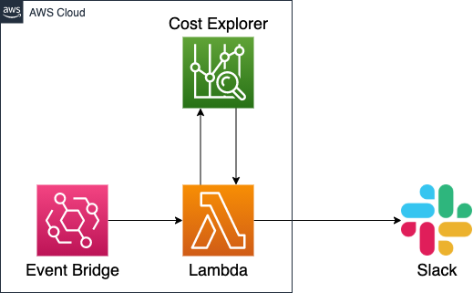

# aws-cost-notification
Notify AWS cost to Slack using AWS Lambda + Cost Explorer




# Prerequisites
## IAM policies required for deployment

You must create an IAM user for deployment.

- AWSLambda_FullAccess
- AmazonS3FullAccess
- CloudWatchEventsFullAccess
- AWSCloudFormationFullAccess
- IAMFullAccess

TODO: Because these policies are too much, it is better to reduce allowed actions.

## Slack Webhook URL

You can create a Slack app and Incoming Webhook as below:

https://api.slack.com/messaging/webhooks

Webhook URL is required in deployment.

# SAM Config
Before building and deployment, samconfig.toml must be set as below:

```toml:samconfig.toml
version = 0.1
[default.global.parameters]
capabilities = "CAPABILITY_IAM"
parameter_overrides = [
  "SlackWebhookURL={Slack Webhook URL}",
  "ReportingTimezone={Timezone for reporting date e.g. Asia/Tokyo}"
]
profile = "{IAM user profile name for deployment}"
region = "{region}"
s3_bucket = "{S3 bucket name to save Cloud Formation stack}"
stack_name = "cost-notifier-stack"
```

# Build and Deploy Commands

## Build

Compile the code of the Lambda function and build AWS Serverless Application Model (SAM) template.

```sh
make build
```

To avoid complicated local environment settings, Docker is used for compling the code ([see here](https://github.com/awslabs/aws-lambda-rust-runtime/issues/17)).
When you compile the code for the first time, you have to build docker container image at first:

```sh
make build-image
```

## Deploy

Deploy the Lambda function by SAM.

```sh
make deploy
```
